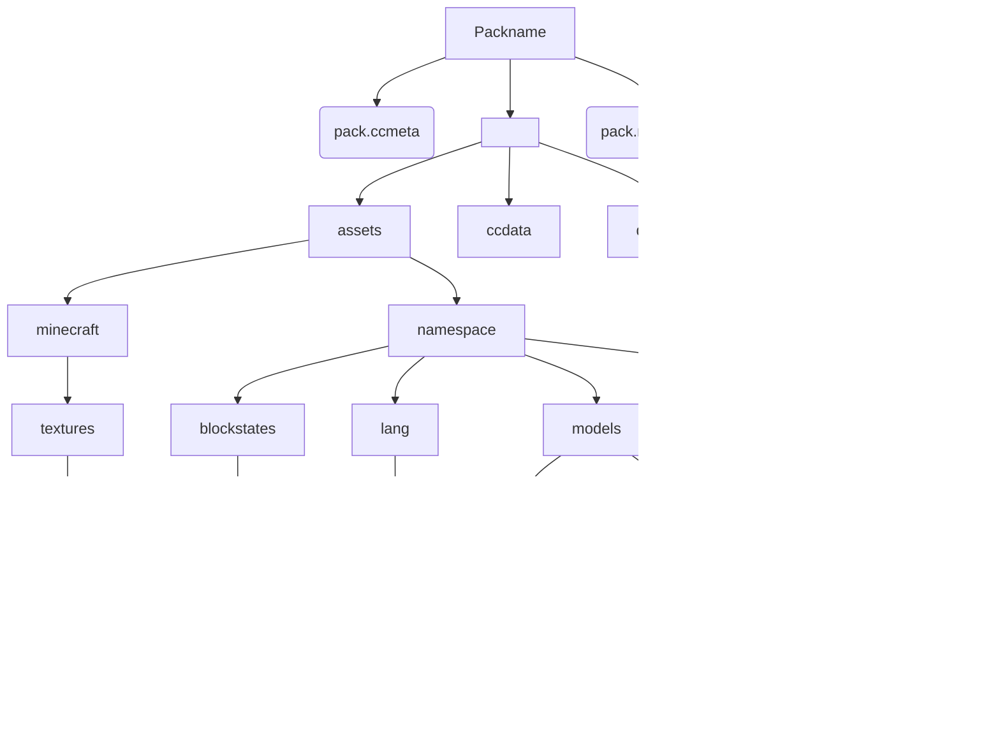

# Welcome
Welcome to the documentation for the CCpack mod!

```mermaid
graph TD
A[Packname]
A --> C(pack.ccmeta)
A --> B[ ]
A --> D(pack.mcmeta)

B --> E[assets]
E --> E1[minecraft] --> E1.1[textures] --> E1.2[models] --> E1.3[armor] --> E1.4[[.png]]
E --> E2[namespace]
E2 --> E2.1[blockstates] --> E2.1.1([.json])
E2 --> E2.2[lang] --> E2.2.1([.json])
E2 --> E2.3[models]
E2.3 --> E2.3.1[block] --> E2.3.1.1([.json])
E2.3 --> E2.3.2[item] --> E2.3.2.1([.json])
E2 --> E2.4[textures]
E2.4 --> E2.4.1[block] --> E2.4.1.1[[.png]]
E2.4 --> E2.4.2[item] --> E2.4.2.1[[.png]]

B --> F[ccdata]


B --> G[data]
```
